# My Life Conduit

A domain-driven design project implementing secure, event-sourced architecture with strong encryption and data sharing capabilities.

## Architecture Diagram

```mermaid
classDiagram
    %% Core DDD Classes
    class Entity~ID~ {
        +ID id
        +getId() ID
        +equals(Object o) boolean
        +hashCode() int
    }
    
    class EntityId {
        +UUID value
        +getValue() UUID
        +equals(Object o) boolean
        +hashCode() int
        +toString() String
    }
    
    class Aggregate {
        -AggregateId id
        -List~DomainEvent~ uncommittedEvents
        +applyEvent(DomainEvent event) void
        #updateState(DomainEvent event) void
        +getId() AggregateId
        +getUncommittedEvents() List~DomainEvent~
    }
    
    class AggregateId {
        +UUID value
    }
    
    %% Event Classes
    class DomainEvent {
        +getEventId() EventId
        +getOccurredAt() Instant
        +getAggregateId() AggregateId
        +getEventType() String
        +getEventVersion() int
    }
    
    class EventId {
        +UUID value
    }
    
    class AbstractDomainEvent {
        -EventId eventId
        -Instant occurredAt
        -AggregateId aggregateId
        -String eventType
        -int eventVersion
    }
    
    class DataSharingAuthorized {
        -KeySharingId sharingId
        -UserId ownerUserId
        -EncryptionKeyId dataKeyId
        -SharingTarget target
        -String dataName
        -DataSharingPurpose purpose
        -Instant expiresAt
    }
    
    class DataSharingRevoked {
        -KeySharingId sharingId
        -UserId revokingUserId
        -String revocationReason
    }
    
    %% Encryption Domain
    class EncryptionMetadataId {
        <<extends EntityId>>
    }
    
    class EncryptionMetadata {
        -String algorithmName
        -String version
        -String description
        -int keySizeInBits
        -boolean supportsFutureProofing
    }
    
    class EncryptionAlgorithm {
        <<interface>>
        +getMetadataId() EncryptionMetadataId
        +encrypt(byte[] data, byte[] key) byte[]
        +decrypt(byte[] encryptedData, byte[] key) byte[]
    }
    
    class EncryptionKeyId {
        <<extends EntityId>>
    }
    
    class EncryptedData {
        -byte[] ciphertext
        -EncryptionMetadataId encryptionMetadataId
        -EncryptionKeyId dataKeyId
    }
    
    class DataKey {
        -byte[] wrappedKey
        -EncryptionKeyId masterKeyId
        -EncryptionMetadataId encryptionMetadataId
    }
    
    class MasterKey {
        -byte[] keyMaterial
        -TenantId tenantId
    }
    
    class KeySharingId {
        <<extends EntityId>>
    }
    
    class KeySharing {
        -EncryptionKeyId dataKeyId
        -AccessSubject grantor
        -AccessSubject grantee
        -Instant createdAt
        -Instant expiresAt
        -boolean revoked
        -Instant revokedAt
    }
    
    class EncryptionService {
        <<interface>>
        +encrypt(UserId userId, byte[] data, EncryptionMetadataId metadataId) EncryptedData
        +decrypt(EncryptedData encryptedData, EncryptionMetadataId metadataId) byte[]
        +createUserKeySharing(EncryptionKeyId keyId, UserId grantor, UserId grantee, Duration duration) KeySharing
        +createRoleKeySharing(EncryptionKeyId keyId, UserId grantor, String role, Duration duration) KeySharing
        +revokeKeySharing(KeySharingId id) void
        +getOrCreateDataKeyForUser(UserId userId, TenantId tenantId) EncryptionKeyId
    }
    
    %% User Domain
    class UserId {
        <<extends EntityId>>
    }
    
    class SubscriberId {
        <<extends AggregateId>>
        +fromUserId(UserId userId) SubscriberId
    }
    
    class SharingTarget {
        <<interface>>
        +getType() SharingTargetType
    }
    
    class UserTarget {
        +UserId userId
    }
    
    class RoleTarget {
        +String roleName
    }
    
    class TenantTarget {
        +TenantId tenantId
    }
    
    class DataSharingPurpose {
        +String code
        +String description
        +String customReason
    }
    
    class DataSharingAuthorization {
        -SubscriberId ownerSubscriberId
        -UserId ownerUserId
        -SharingTarget target
        -String dataName
        -DataSharingPurpose purpose
        -Instant authorizedAt
        -Instant expiresAt
        -boolean revoked
        -Instant revokedAt
        -String revocationReason
        +revoke(Instant revokedAt, String reason) void
        +isActive(Instant now) boolean
    }
    
    class DataSharingService {
        <<interface>>
        +authorizeUserSharing(SubscriberId subId, EncryptionKeyId keyId, UserId target, String dataName, DataSharingPurpose purpose, Duration duration) DataSharingAuthorization
        +authorizeRoleSharing(SubscriberId subId, EncryptionKeyId keyId, String role, String dataName, DataSharingPurpose purpose, Duration duration) DataSharingAuthorization
        +revokeAuthorization(KeySharingId id, SubscriberId subId, String reason) void
        +listActiveAuthorizationsGrantedBy(SubscriberId subId) Iterable~DataSharingAuthorization~
        +listActiveAuthorizationsGrantedTo(UserId userId) Iterable~DataSharingAuthorization~
    }
    
    %% Relationships
    EntityId <|-- EncryptionKeyId
    EntityId <|-- EncryptionMetadataId
    EntityId <|-- KeySharingId
    EntityId <|-- EventId
    EntityId <|-- UserId
    
    AggregateId <|-- SubscriberId
    
    Entity <|-- EncryptionMetadata
    Entity <|-- DataKey
    Entity <|-- MasterKey
    Entity <|-- KeySharing
    Entity <|-- DataSharingAuthorization
    
    DomainEvent <|.. AbstractDomainEvent
    AbstractDomainEvent <|-- DataSharingAuthorized
    AbstractDomainEvent <|-- DataSharingRevoked
    
    SharingTarget <|.. UserTarget
    SharingTarget <|.. RoleTarget
    SharingTarget <|.. TenantTarget
    
    DataSharingService --> EncryptionService : coordinates with
    DataSharingService --> DataSharingAuthorization : creates
    DataSharingService --> DataSharingAuthorized : emits
    DataSharingService --> DataSharingRevoked : emits
    
    EncryptionService --> EncryptedData : produces
    EncryptionService --> DataKey : manages
    EncryptionService --> MasterKey : uses
    EncryptionService --> KeySharing : creates
    
    DataSharingAuthorization --> KeySharingId : references
    DataSharingAuthorization --> SubscriberId : owned by
    DataSharingAuthorization --> SharingTarget : shares with
    
    EncryptedData --> EncryptionMetadataId : references
    EncryptedData --> EncryptionKeyId : references
    
    DataKey --> EncryptionKeyId : identified by
    DataKey --> EncryptionMetadataId : encrypted with
    
    MasterKey --> EncryptionKeyId : identified by
    
    KeySharing --> KeySharingId : identified by
    KeySharing --> EncryptionKeyId : shares
```

## Architecture Flow

1. A subscriber authorizes sharing through the DataSharingService
2. DataSharingService delegates key operations to EncryptionService
3. EncryptionService creates a KeySharing in the encryption domain
4. DataSharingService creates a DataSharingAuthorization in the user domain
5. DataSharingService emits domain events (DataSharingAuthorized)
6. When data is encrypted/decrypted, EncryptionService handles the technical aspects
7. Access control is enforced by checking the KeySharing grants

## Domain Boundaries

This architecture maintains clear separation between:
- **User domain** (business authorization) - Handles the business logic of who can share what with whom and for what purpose
- **Encryption domain** (technical implementation) - Manages the cryptographic operations, key management, and technical aspects of data protection

## Key Features

- Strong encryption with pluggable algorithms
- Envelope encryption model with user data keys and tenant master keys
- Granular data sharing with expiration and revocation
- Event-sourced design for complete audit trail
- Domain-driven design with clear bounded contexts
- Strong typing for domain identifiers